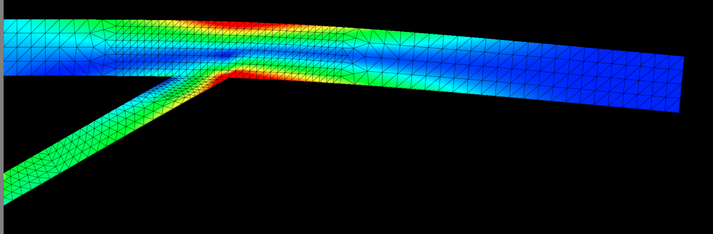

# gpu_finite_element
A rudimentary proof of concept: GPU accelerated structural stress solver using
finite element analysis and CUDA. Also has CPU-only version without CUDA
dependency.

Has up to 3rd order 2D triangular elements (cubic shape functions).


*Image: von Mises stress of 2D beam fixed on left and pulled down by gravity*

## Compiling
gcc >= v4.7.0, make, POSIX (aka not Windows)
- `make gpu`: depends on existing CUDA installation (`nvcc`) and NVIDIA graphics
card for GPU acceleration
- `make`: no dependencies; non-GPU, CPU-only unoptimized single core
- `make animate`: slow down iterative solver to animate/visualize iterations and
convergence; non-GPU, CPU-only

```bash
cd src
make animate
./a.out
```
```bash
cd viewer
python -m http.server
```
View at `http://localhost:8000/` using [websocket_ctube](https://github.com/bryance-oyang/websocket_ctube).

## Brief notes
If $\psi^j$ is a small displacement field with $j$ indexing the spatial
directions, then the linearized strain is
$$
\epsilon^{ij} = \frac{1}{2}(\nabla^i \psi^j + \nabla^j \psi^i)
$$
and for a simple linear elasticity $E$, the stress is
$$
\sigma^{ij} = E^{ij}{}_{kl} \epsilon^{kl}
$$
and Newton's second law $(F = ma)$ with density $\rho$ and external forces per
volume $f^j$ is
$$
\rho \frac{\partial^2 \psi^j}{\partial t^2} = \nabla_i \sigma^{ij} + f^j
$$

To solve for the steady state
($0 = \nabla_i \sigma^{ij} + f^j$),
discretize by choosing some basis functions $u(x)$ (shape functions representing
the degrees of freedom of interest) and expanding
$$
\psi^j(x) = \sum_n c_n u_n^j(x)
$$
and then require that the coefficients $c$ make the following inner product zero
with each $u$ (discretized weak form):
$$
0 = \int u_{mj} (\nabla_i \sigma^{ij} + f^j)\,d^3x
$$

This gives the matrix problem for the coefficients $c$
$$
\sum_{n} A_{mn} c_n = b_m
$$
where
$$
A_{mn} = -\frac{1}{2}\int u_{mj} \nabla_i E^{ij}{}_{kl} (\nabla^k u_n^l + \nabla^l u_n^k)\,d^3x\\
b_m = \int u_{mj}f^j\,d^3x
$$
and $A$ (the stiffness matrix) is symmetric with appropriate boundary conditions
and sparse if the shape functions $u$ were chosen to have little overlap.

The conjugate gradient method can iteratively solve this for the coefficients
$c$ and give the discretized solution.
